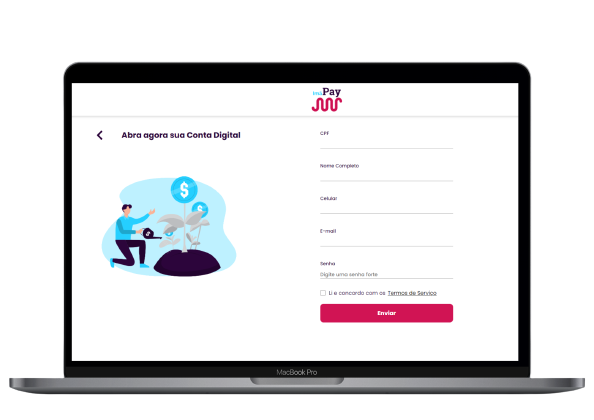
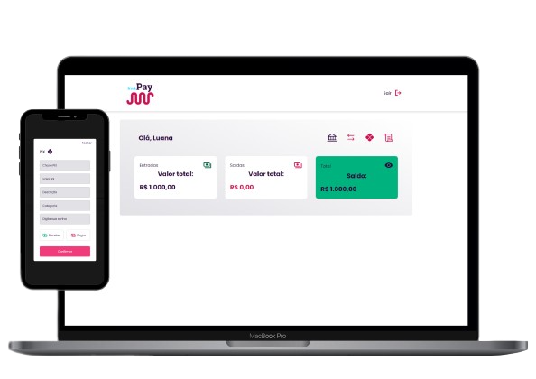

<a name="readme-top"></a>

<h2 align="center">🚧🚀 Em desenvolvimento</h2>

<br />

## Sobre o projeto 💻

💪 Bem-vindo ao Imã Pay!

A Imã Pay foi criada em abril de 2023, inspirada na Imã Tech e sob orientação do Prof. Hugo Rafael. Promete revolucionar o mercado financeiro por ser um banco inovador que compete com os atuais grandes bancos, oferecendo novas propostas de negociação, taxas competitivas e retornos adequados à realidade de cada cliente. Nosso objetivo é transformar a experiência do usuário com mais comodidade, rapidez e praticidade em todas as etapas, desde a criação da conta até as transações diárias.

<!--ts-->

- [Sobre o projeto](#sobre-o-projeto-💻)
  - [Funcionalidades](#funcionalidades-⚙️)
  - [Layout](#layout-🎨)
  - [Como executar o projeto](#como-executar-o-projeto-🚀)
  - [Tecnologias](#tecnologias-🛠)
  - [Contribuir como o projeto](#contribuindo-para-project-ima-pay-📫)
  - [Colaboradores](#colaboradores-🤝)
  - [Licença](#licença-📝)
  <!--te-->

---

<br />

## Funcionalidades ⚙️

Cadastro de Usuário: Nosso processo de cadastro é simples e intuitivo. Ao acessar a página, o cliente preencherá cada etapa e confirmará a cada nova entrada de dados. Seus dados serão protegidos de acordo com os termos de uso aceitos.

Login: Nosso processo de login é rápido e responsivo. Após o cadastro, o cliente poderá utilizar seu CPF e senha ou e-mail e senha, conforme sua escolha no ato do cadastro.

Transferência: Para efetuar uma transferência bancária, serão solicitados ao cliente os dados do destinatário e a senha de confirmação previamente cadastrada. Essa transferência pode ser opcional em TED, DOC ou PIX.

Histórico de transações: Nosso histórico de transações mostrará ao usuário a data e hora da transação, os valores acordados e as informações do destinatário. É detalhado o suficiente para o usuário verificar e guardar para referência futura ou simples confirmação.

Obrigado por escolher o Imã Pay. Estamos entusiasmados por ser sua solução bancária inovadora e competitiva.

👷🏻 Em construção:

API em C# com os endpoints de cadastro, login, dados do cliente, transferências e histórico de transações.

```bash
# Para simular o cadastro de cliente, utilize os dados abaixo:

Nome: "Luana"
E-mail: "luana@teste.com"
Senha: "rafa158"
Celular: "41 99916-1514"
CPF: "157.526.142-23"

# Para login, utilize:

CPF: "157.526.142-23"
Senha: "rafa158"
```

---

<br />

## Layout 🎨

O layout da aplicação:

<p align="center">
  
  
  
  
  

</p>

---

<br />

## Como executar o projeto 🚀

Pré-requisitos

Antes de começar, você vai precisar ter instalado em sua máquina as seguintes ferramentas:
[Git](https://git-scm.com), ter um editor para trabalhar com o código como [VSCode](https://code.visualstudio.com/).
Para rodar o repositório é necessário clonar o mesmo, dar o seguinte comando para iniciar o projeto:

```bash
Depois de baixar o projeto e abrir no gitbash ou no terminal do VSCode.

# Navegue até o diretório
$ cd frontend

# Para instalações da dependências digite:
$ npm i

# Para rodar o projeto digite:
$ npm run dev
# No terminal será exibido o endereço local onde a aplicação está sendo executada. Basta digitar o mesmo endereço em seu navegador preferido ou selecionar a tecla CTRL + click do mouse.

# Para executar o servidor
$ npx json-server server.json -p 3333 -w -d 500 (para rodar o servidor server.json)

# Para iniciar o servidor
$ npm run dev:server
```

---

<br />

## Tecnologias 🛠

As seguintes ferramentas foram usadas na construção do projeto:

- HTML
- CSS
- C#
- JavaScript
- ReactJS
- TypeScript

```bash
Bibliotecas do Front-end:

. npm i styled-components
. npm i @types/styled-components -D
. npm i json-server -D
. npm i @radix-ui/react-dialog
. npm i @radix-ui/react-radio-group
. npm i react-router-dom
. npm i phosphor-react
. npm i react-hook-form
. npm i @hookform/resolvers
. npm i zod
. npm i axios
. npm i use-context-selector scheduler
. npm i polished
```

---

<br />

## Contribuindo para project-ima-pay 📫

<!---separado--->

Para contribuir com project-ima-pay, siga estas etapas:

1. Bifurque (Fork) este repositório.
2. Crie um branch: `git checkout -b <nome_branch>`.
3. Faça suas alterações e confirme-as: `git commit -m '<mensagem_commit>'`
4. Envie para o branch original: `git push origin <nome_do_projeto> / <local>`
5. Crie a solicitação de pull.

Consulte a documentação do GitHub em [como criar uma solicitação pull](https://help.github.com/en/github/collaborating-with-issues-and-pull-requests/creating-a-pull-request).

---

<br />

## Colaboradores 🤝

Agradecemos às seguintes pessoas que contribuíram para este projeto:

<table>
  <tr>
    <td align="center">
      <a href="https://github.com/denilsonbezerra">
        <br>
        <sub>
          <b>Denilson</b>
        </sub>
      </a>
    </td>
    <td align="center">
      <a href="https://github.com/IsabelaSchadt">
        <br>
        <sub>
          <b>Isabela</b>
        </sub>
      </a>
    </td>
    <td align="center">
      <a href="https://github.com/LuciaSantos81">
        <br>
        <sub>
          <b>Lúcia</b>
        </sub>
      </a>
    </td>
    <td align="center">
      <a href="https://github.com/MatheusHenrique95">
        <br>
        <sub>
          <b>Matheus</b>
        </sub>
      </a>
    </td>
    <td align="center">
      <a href="https://github.com/MOISANX">
        <br>
        <sub>
          <b>Moises</b>
        </sub>
      </a>
    </td>
    <td align="center">
      <a href="https://github.com/RafaelSantos22">
        <br>
        <sub>
          <b>Rafael</b>
        </sub>
      </a>
    </td>
    <td align="center">
      <a href="https://github.com/RafaeltiMoreira">
        <br>
        <sub>
          <b>Rafael</b>
        </sub>
      </a>
    </td>
  </tr>
</table>

---

<br />

## Licença 📝

Esse projeto está sob licença [MIT](https://github.com/RafaeltiMoreira/sharnonymous-bank-ima/blob/main/LICENSE). Veja o arquivo [LICENÇA](LICENSE.md) para mais detalhes.

By S#harnonymous

<br />

<p>(<a href="#readme-top">⬆ Voltar ao topo</a>)</p>
